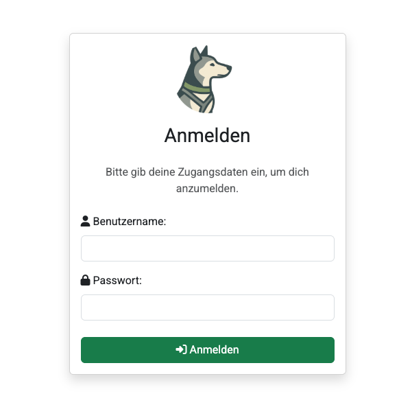

# Plattform öffnen

## 1. Browser öffnen  
Öffne einen aktuellen Browser (Chrome, Firefox, Edge oder Safari).

## 2. URL eingeben  
Rufe die Adresse deiner PfotenRegister-Instanz auf. Wenn PfotenRegister diese hostet, folgt diese dem Schema <Organisationsmae\>.pfotenregister.com.

## 3. Anmelden  
1. Gib deinen Benutzernamen E-Mail-Adresse und dein Passwort ein.  
2. Klicke auf **Anmelden**.

> **Tipp:** Falls du dein Passwort vergessen hast, melde dich bei deinem Admin! Solltest du als Admin keinen Zugang mehr haben, kontaktiere uns bitte unter [admin@pfotenregister.com](mailto:admin@pfotenregister.com)

---
