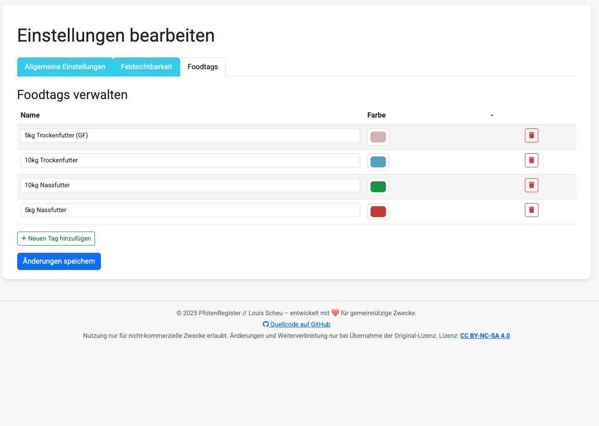
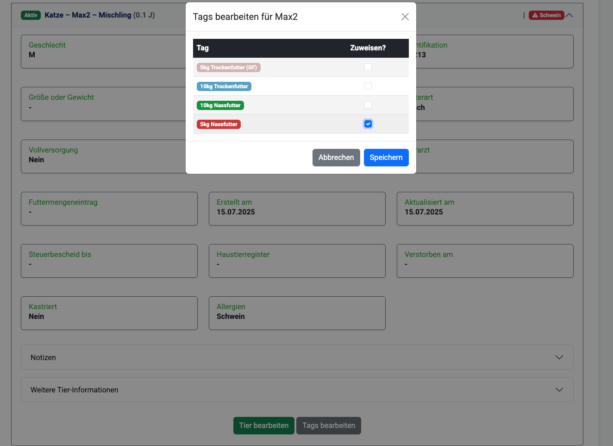
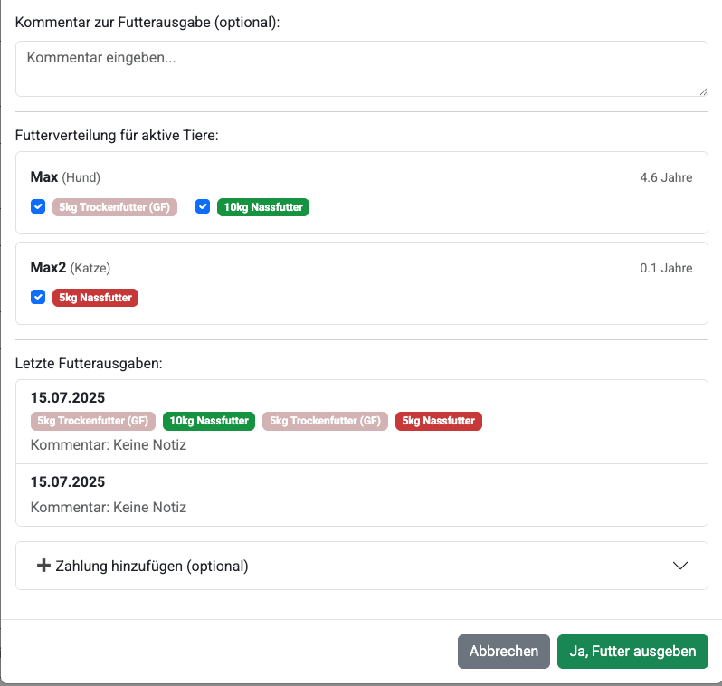

<!-- Datei: docs/workflows/tags-system.md -->

# Workflow: Tagsystem anlegen und verwenden

Dieses Kapitel beschreibt, wie du als Admin das Tagsystem aktivierst und verwaltest und wie Editor:innen oder Admins die erstellten Tags anschließend bei Tieren und in der Futterausgabe einsetzen.

---

## 1. Tagsystem aktivieren (Admin)

1. Klicke oben im Hauptmenü auf **Admin-Bereich**.  
2. Wähle in der Seitenleiste **Einstellungen** aus.  
3. Suche im Abschnitt **Features** nach **Tagsystem** und aktiviere den Schalter, falls er noch nicht gesetzt ist.  
4. Wechsle auf den Tab **Foodtags**.

---

## 2. Tags verwalten (Admin)

1. **Neuen Tag anlegen**  
   - Klicke auf **Neuen Tag hinzufügen**.  
   - Gib einen eindeutigen **Namen** ein.  
   - Wähle über den Farbpicker eine **Anzeige-Farbe** aus.  
   - Klicke auf **Speichern**.  

2. **Tag bearbeiten**  
   - Finde in der Liste den gewünschten Tag.  
   - Klicke auf das **Stift-Icon** (Bearbeiten).  
   - Ändere Name oder Farbe und bestätige mit **Speichern**.  

3. **Tag löschen**  
   - Klicke in der Liste auf das **Müllkorb-Icon** des entsprechenden Tags.  
   - Bestätige im Dialog mit **Löschen**.  

   

---

## 3. Tags einem Tier zuweisen (Editor:innen & Admins)

1. Öffne im linken Menü **Gäste verwalten** und wähle einen Gast aus.  
2. Scrolle zum Abschnitt **Tiere** und klicke auf das Tier, dem du Tags zuweisen möchtest.  
3. Klicke im Tier-Detailbereich auf **Tags bearbeiten**.  
4. Markiere alle Tags, die zu diesem Tier passen, oder entferne Häkchen bei nicht mehr gültigen Tags.  
5. Klicke auf **Speichern**.  

   

---

## 4. Tags in der Futterausgabe sehen

- Beim Anlegen oder Bearbeiten einer **Futterausgabe** werden die Tags des jeweiligen Tieres automatisch angezeigt.  
- In der **Ausgabehistorie** siehst du ebenfalls auf einen Blick alle hinterlegten Tags.
  
- 

---

> **Hinweis:**  
> • Neue oder geänderte Tags können jederzeit in der Admin-Einstellung angepasst werden.  
> • Tags helfen dabei können Futterhinweise ersetzen. Nutze das Feld "Futterhinweis" dann für Vorlieben oder ähnliches.